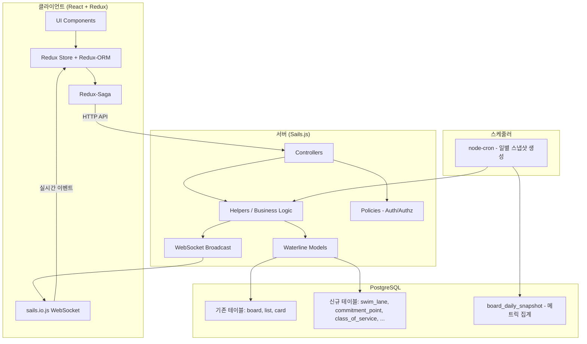

# 기술 설계 문서: 칸반 시스템 고도화 (Kanban System Enhancement)

## Overview

Planka를 단순 태스크 매니저에서 진정한 칸반 시스템으로 고도화하기 위한 기술 설계 문서이다. LEAN 사상과 칸반 6가지 일반 실천법(Visualize, Limit WIP, Manage Flow, Make Policies Explicit, Implement Feedback Loops, Improve Collaboratively)을 기반으로 10개의 핵심 기능을 구현한다.

### 설계 원칙

1. **기존 Planka 아키텍처 존중**: Sails.js MVC 패턴, Redux-Saga, WebSocket 실시간 동기화 패턴을 그대로 따른다
2. **점진적 확장**: 기존 테이블(card, list, board)에 컬럼을 추가하고, 새 테이블은 기존 패턴과 동일한 구조로 생성한다
3. **성능 우선**: 메트릭 계산은 사전 집계(board_daily_snapshot)로 처리하고, 실시간 계산은 최소화한다
4. **Pull 시스템 시각화**: WIP 제한과 빈 슬롯 표시를 통해 Pull 시스템의 동작을 직관적으로 전달한다

---

## Architecture

### 시스템 아키텍처 다이어그램



### 주요 아키텍처 결정

| 결정 사항 | 선택 | 근거 |
|-----------|------|------|
| 메트릭 데이터 저장 | 사전 집계 (board_daily_snapshot) | 실시간 CFD 계산은 대량 카드 보드에서 성능 문제 유발 |
| WIP 제한 방식 | 소프트 제한 (경고 후 허용) | 칸반 이론에서 WIP 초과는 차단이 아닌 시각적 경고가 원칙 |
| 카드 이동 이력 | card_movement_log 별도 테이블 | Lead Time 계산 및 CFD 정확도를 위해 모든 이동을 기록 |
| 스윔레인 구현 | 별도 swim_lane 테이블 + card.swim_lane_id | 기존 card 테이블에 최소 변경으로 스윔레인 지원 |
| 서브컬럼 구현 | list 테이블 확장 (parent_list_id, sub_column_type) | 기존 List 모델을 재활용하여 Active/Done 서브컬럼 표현 |
| 차트 라이브러리 | Recharts | React 생태계 호환, 가볍고 커스터마이징 용이 |

---

## Components and Interfaces

### 서버 컴포넌트 구조

```
server/api/
├── controllers/
│   ├── swim-lanes/          # 스윔레인 CRUD
│   │   ├── create.js
│   │   ├── update.js
│   │   ├── delete.js
│   │   └── sort.js
│   ├── commitment-points/   # Commitment Point CRUD
│   │   ├── create.js
│   │   ├── update.js
│   │   └── delete.js
│   ├── classes-of-service/  # 서비스 클래스 CRUD
│   │   ├── create.js
│   │   ├── update.js
│   │   └── delete.js
│   ├── blockers/            # 블로커 관리
│   │   ├── create.js
│   │   ├── update.js
│   │   ├── delete.js
│   │   └── create-linked-card.js
│   ├── card-relationships/  # 카드 관계 (하위 티켓)
│   │   ├── create.js
│   │   ├── delete.js
│   │   └── sort.js
│   ├── decorators/          # 데코레이터 CRUD
│   │   ├── create.js
│   │   ├── update.js
│   │   └── delete.js
│   ├── card-decorators/     # 카드-데코레이터 연결
│   │   ├── create.js
│   │   └── delete.js
│   └── metrics/             # 메트릭 대시보드
│       ├── show-cfd.js
│       ├── show-lead-time.js
│       ├── show-throughput.js
│       └── show-wip-aging.js
├── helpers/
│   ├── swim-lanes/
│   ├── commitment-points/
│   ├── classes-of-service/
│   ├── blockers/
│   ├── card-relationships/
│   ├── decorators/
│   ├── card-decorators/
│   ├── metrics/
│   │   ├── generate-daily-snapshot.js
│   │   ├── calculate-cfd.js
│   │   ├── calculate-lead-time.js
│   │   ├── calculate-throughput.js
│   │   └── calculate-wip-aging.js
│   └── cards/
│       └── record-movement.js  # 카드 이동 시 이력 기록
└── models/
    ├── SwimLane.js
    ├── CommitmentPoint.js
    ├── CardCommitmentLog.js
    ├── ClassOfService.js
    ├── Decorator.js
    ├── CardDecorator.js
    ├── Blocker.js
    ├── CardRelationship.js
    ├── BoardDailySnapshot.js
    └── CardMovementLog.js
```

### 클라이언트 컴포넌트 구조

```
client/src/
├── components/
│   ├── swim-lanes/
│   │   ├── SwimLane.jsx              # 스윔레인 행 컨테이너
│   │   ├── SwimLaneHeader.jsx        # 스윔레인 헤더 (이름, WIP 표시)
│   │   ├── SwimLaneSettings.jsx      # 스윔레인 설정 팝업
│   │   └── AddSwimLaneButton.jsx
│   ├── lists/
│   │   ├── WipLimitIndicator.jsx     # WIP 제한 표시 (현재/제한)
│   │   ├── PullSlot.jsx             # 빈 슬롯 (점선 카드)
│   │   ├── SubColumn.jsx            # Active/Done 서브컬럼
│   │   ├── PullCriteriaPopover.jsx  # Pull Criteria 팝오버
│   │   ├── PolicyPopover.jsx        # Policy 팝오버
│   │   └── ColumnSettings.jsx       # 컬럼 설정 (WIP, 서브컬럼, 버퍼)
│   ├── cards/
│   │   ├── CardSlaBar.jsx           # SLA 진행 바
│   │   ├── CardBlockerBadge.jsx     # 블로커 배지
│   │   ├── CardDecoratorIcons.jsx   # 데코레이터 아이콘
│   │   ├── CardPriority.jsx         # 우선순위 표시
│   │   ├── CardTicketAge.jsx        # 티켓 나이 표시
│   │   ├── CardSubTicketProgress.jsx # 하위 티켓 진행률
│   │   ├── CardClassOfServiceStripe.jsx # CoS 색상 띠
│   │   ├── BlockerSection.jsx       # 카드 상세 - 블로커 섹션
│   │   └── SubTicketSection.jsx     # 카드 상세 - 하위 티켓 섹션
│   ├── commitment-points/
│   │   ├── CommitmentPointLine.jsx  # 구분선 표시
│   │   └── CommitmentPointSettings.jsx
│   ├── classes-of-service/
│   │   ├── ClassOfServiceList.jsx   # CoS 목록 관리
│   │   └── ClassOfServicePicker.jsx # CoS 선택기
│   ├── pull-system/
│   │   ├── PullArrow.jsx           # Pull 방향 화살표
│   │   ├── PullableCardHighlight.jsx # Pull 가능 카드 강조
│   │   └── SystemWipIndicator.jsx  # 시스템 WIP 표시
│   └── metrics/
│       ├── MetricsDashboard.jsx     # 대시보드 메인
│       ├── CfdChart.jsx            # CFD 차트
│       ├── LeadTimeHistogram.jsx   # 리드타임 히스토그램
│       ├── RunChart.jsx            # Run Chart
│       ├── WipAgingChart.jsx       # WIP Aging Chart
│       ├── LittleLawSummary.jsx    # 리틀의 법칙 요약
│       └── MetricsFilter.jsx       # 날짜/CoS 필터
├── actions/
│   ├── swim-lanes.js
│   ├── commitment-points.js
│   ├── classes-of-service.js
│   ├── blockers.js
│   ├── card-relationships.js
│   ├── decorators.js
│   ├── card-decorators.js
│   └── metrics.js
├── sagas/
│   ├── swim-lanes.js
│   ├── commitment-points.js
│   ├── classes-of-service.js
│   ├── blockers.js
│   ├── card-relationships.js
│   ├── decorators.js
│   ├── card-decorators.js
│   └── metrics.js
├── selectors/
│   ├── swim-lanes.js
│   ├── commitment-points.js
│   ├── classes-of-service.js
│   ├── blockers.js
│   ├── card-relationships.js
│   └── metrics.js
└── models/
    ├── SwimLane.js
    ├── CommitmentPoint.js
    ├── ClassOfService.js
    ├── Decorator.js
    ├── Blocker.js
    ├── CardRelationship.js
    └── BoardDailySnapshot.js
```

---

## Data Models

### ERD (Entity Relationship Diagram)

```mermaid
erDiagram
    board ||--o{ swim_lane : "has"
    board ||--o{ commitment_point : "has"
    board ||--o{ class_of_service : "has"
    board ||--o{ decorator : "has"
    board ||--o{ board_daily_snapshot : "has"
    board ||--o{ card_movement_log : "tracks"

    list ||--o{ list : "parent_list_id (서브컬럼)"

    card ||--o| swim_lane : "belongs to"
    card ||--o| class_of_service : "classified as"
    card ||--o{ blocker : "has"
    card ||--o{ card_decorator : "has"
    card ||--o{ card_commitment_log : "passes"
    card ||--o{ card_movement_log : "moves"
    card ||--o{ card_relationship : "parent_card_id"
    card ||--o{ card_relationship : "child_card_id"

    blocker ||--o| card : "linked_card_id"
    decorator ||--o{ card_decorator : "used in"
    commitment_point ||--o{ card_commitment_log : "logged"

    swim_lane {
        bigint id PK
        bigint board_id FK
        double_precision position
        text name
        text category
        text type
        integer wip_limit
        text color
    }

    commitment_point {
        bigint id PK
        bigint board_id FK
        bigint left_list_id FK
        bigint right_list_id FK
        double_precision position
        text label
        text type
    }

    card_commitment_log {
        bigint id PK
        bigint card_id FK
        bigint commitment_point_id FK
        text direction
        timestamp passed_at
    }

    class_of_service {
        bigint id PK
        bigint board_id FK
        text name
        text type
        text color
        text policy
        double_precision position
        boolean is_default
    }

    decorator {
        bigint id PK
        bigint board_id FK
        text name
        text icon
        text color
    }

    card_decorator {
        bigint id PK
        bigint card_id FK
        bigint decorator_id FK
    }

    blocker {
        bigint id PK
        bigint card_id FK
        bigint linked_card_id FK
        bigint creator_user_id FK
        text reason
        text status
        timestamp resolved_at
    }

    card_relationship {
        bigint id PK
        bigint parent_card_id FK
        bigint child_card_id FK
        text type
        double_precision position
    }

    board_daily_snapshot {
        bigint id PK
        bigint board_id FK
        bigint list_id FK
        integer card_count
        date snapshot_date
    }

    card_movement_log {
        bigint id PK
        bigint card_id FK
        bigint board_id FK
        bigint from_list_id FK
        bigint to_list_id FK
        bigint from_swim_lane_id FK
        bigint to_swim_lane_id FK
        bigint user_id FK
        timestamp moved_at
    }
```



### 기존 테이블 변경사항

#### card 테이블 확장

| 컬럼 | 타입 | 설명 |
|------|------|------|
| swim_lane_id | BIGINT (nullable) | 소속 스윔레인 |
| class_of_service_id | BIGINT (nullable) | 서비스 클래스 |
| priority | TEXT (nullable) | 우선순위: 'H', 'M', 'L' |
| start_date | TIMESTAMP (nullable) | 작업 시작일 |
| completed_at | TIMESTAMP (nullable) | 완료 시점 (Delivery Point 통과 시) |

#### list 테이블 확장

| 컬럼 | 타입 | 설명 |
|------|------|------|
| wip_limit | INTEGER (nullable) | WIP 제한값 (NULL = 무제한) |
| sub_column_type | TEXT (nullable) | 서브컬럼 유형: 'active', 'done' |
| parent_list_id | BIGINT (nullable) | 부모 컬럼 ID (서브컬럼인 경우) |
| is_buffer | BOOLEAN (default: false) | 버퍼 컬럼 여부 |
| pull_criteria | TEXT (nullable) | Pull Criteria 텍스트 |
| policy | TEXT (nullable) | 정책 텍스트 |

#### board 테이블 확장

| 컬럼 | 타입 | 설명 |
|------|------|------|
| system_wip_limit | INTEGER (nullable) | 시스템 레벨 WIP 제한 |

### Waterline 모델 정의 (주요 모델)

#### SwimLane.js

```javascript
const Types = {
  STANDARD: 'standard',
  EXPEDITE: 'expedite',
};

const Categories = {
  WORK_ITEM_TYPE: 'work_item_type',
  CLASS_OF_SERVICE: 'class_of_service',
  REQUESTOR: 'requestor',
  PROJECT: 'project',
};

module.exports = {
  Types,
  Categories,

  attributes: {
    position: { type: 'number', required: true },
    name: { type: 'string', required: true },
    category: { type: 'string', isIn: Object.values(Categories), allowNull: true },
    type: { type: 'string', isIn: Object.values(Types), defaultsTo: Types.STANDARD },
    wipLimit: { type: 'number', allowNull: true, columnName: 'wip_limit' },
    color: { type: 'string', allowNull: true },

    boardId: { model: 'Board', required: true, columnName: 'board_id' },
    cards: { collection: 'Card', via: 'swimLaneId' },
  },
};
```

#### ClassOfService.js

```javascript
const Types = {
  EXPEDITE: 'expedite',
  FIXED_DATE: 'fixed_date',
  STANDARD: 'standard',
  INTANGIBLE: 'intangible',
  CUSTOM: 'custom',
};

module.exports = {
  Types,

  attributes: {
    name: { type: 'string', required: true },
    type: { type: 'string', isIn: Object.values(Types), defaultsTo: Types.CUSTOM },
    color: { type: 'string', required: true },
    policy: { type: 'string', allowNull: true },
    position: { type: 'number', required: true },
    isDefault: { type: 'boolean', defaultsTo: false, columnName: 'is_default' },

    boardId: { model: 'Board', required: true, columnName: 'board_id' },
    cards: { collection: 'Card', via: 'classOfServiceId' },
  },
};
```

#### Blocker.js

```javascript
const Statuses = {
  ACTIVE: 'active',
  RESOLVED: 'resolved',
};

module.exports = {
  Statuses,

  attributes: {
    reason: { type: 'string', required: true },
    status: { type: 'string', isIn: Object.values(Statuses), defaultsTo: Statuses.ACTIVE },
    resolvedAt: { type: 'ref', columnName: 'resolved_at' },

    cardId: { model: 'Card', required: true, columnName: 'card_id' },
    linkedCardId: { model: 'Card', columnName: 'linked_card_id' },
    creatorUserId: { model: 'User', columnName: 'creator_user_id' },
  },
};
```

#### CardRelationship.js

```javascript
const Types = {
  SUB_TICKET: 'sub_ticket',
  BLOCKER: 'blocker',
  RELATED: 'related',
};

module.exports = {
  Types,

  attributes: {
    type: { type: 'string', isIn: Object.values(Types), defaultsTo: Types.SUB_TICKET },
    position: { type: 'number', required: true },

    parentCardId: { model: 'Card', required: true, columnName: 'parent_card_id' },
    childCardId: { model: 'Card', required: true, columnName: 'child_card_id' },
  },
};
```

---

## API 설계 (RESTful Endpoints)

### 스윔레인 API

| Method | Endpoint | 설명 |
|--------|----------|------|
| POST | `/api/boards/:boardId/swim-lanes` | 스윔레인 생성 |
| PATCH | `/api/swim-lanes/:id` | 스윔레인 수정 (이름, WIP, 색상, 순서) |
| DELETE | `/api/swim-lanes/:id` | 스윔레인 삭제 |
| POST | `/api/swim-lanes/:id/sort` | 스윔레인 순서 변경 |

### Commitment Point API

| Method | Endpoint | 설명 |
|--------|----------|------|
| POST | `/api/boards/:boardId/commitment-points` | Commitment Point 생성 |
| PATCH | `/api/commitment-points/:id` | Commitment Point 수정 |
| DELETE | `/api/commitment-points/:id` | Commitment Point 삭제 |

### 서비스 클래스 API

| Method | Endpoint | 설명 |
|--------|----------|------|
| POST | `/api/boards/:boardId/classes-of-service` | 서비스 클래스 생성 |
| PATCH | `/api/classes-of-service/:id` | 서비스 클래스 수정 |
| DELETE | `/api/classes-of-service/:id` | 서비스 클래스 삭제 |

### 블로커 API

| Method | Endpoint | 설명 |
|--------|----------|------|
| POST | `/api/cards/:cardId/blockers` | 블로커 등록 |
| PATCH | `/api/blockers/:id` | 블로커 수정 (상태 변경 포함) |
| DELETE | `/api/blockers/:id` | 블로커 삭제 |
| POST | `/api/blockers/:id/create-linked-card` | 블로커 연결 카드 생성 |

### 카드 관계 (하위 티켓) API

| Method | Endpoint | 설명 |
|--------|----------|------|
| POST | `/api/cards/:cardId/relationships` | 카드 관계 생성 (하위 티켓 추가) |
| DELETE | `/api/card-relationships/:id` | 카드 관계 삭제 |
| POST | `/api/cards/:cardId/relationships/sort` | 하위 티켓 순서 변경 |

### 데코레이터 API

| Method | Endpoint | 설명 |
|--------|----------|------|
| POST | `/api/boards/:boardId/decorators` | 데코레이터 생성 |
| PATCH | `/api/decorators/:id` | 데코레이터 수정 |
| DELETE | `/api/decorators/:id` | 데코레이터 삭제 |
| POST | `/api/cards/:cardId/decorators` | 카드에 데코레이터 연결 |
| DELETE | `/api/card-decorators/:id` | 카드에서 데코레이터 제거 |

### 메트릭 API

| Method | Endpoint | 설명 |
|--------|----------|------|
| GET | `/api/boards/:boardId/metrics/cfd` | CFD 데이터 조회 |
| GET | `/api/boards/:boardId/metrics/lead-time` | Lead Time 분포 조회 |
| GET | `/api/boards/:boardId/metrics/throughput` | Throughput 추이 조회 |
| GET | `/api/boards/:boardId/metrics/wip-aging` | WIP Aging 데이터 조회 |
| GET | `/api/boards/:boardId/metrics/summary` | Little's Law 요약 조회 |

### 기존 API 확장

| Method | Endpoint | 변경 사항 |
|--------|----------|-----------|
| PATCH | `/api/cards/:id` | swimLaneId, classOfServiceId, priority, startDate 필드 추가 |
| PATCH | `/api/lists/:id` | wipLimit, subColumnType, parentListId, isBuffer, pullCriteria, policy 필드 추가 |
| PATCH | `/api/boards/:id` | systemWipLimit 필드 추가 |
| GET | `/api/boards/:id` | 응답에 swimLanes, commitmentPoints, classesOfService, decorators 포함 |

### API 요청/응답 예시

#### 스윔레인 생성

```json
// POST /api/boards/:boardId/swim-lanes
// Request
{
  "name": "Feature Development",
  "category": "work_item_type",
  "type": "standard",
  "wipLimit": 5,
  "position": 65536,
  "color": "lagoon-blue"
}

// Response
{
  "item": {
    "id": "1357158568008091300",
    "boardId": "1357158568008091264",
    "name": "Feature Development",
    "category": "work_item_type",
    "type": "standard",
    "wipLimit": 5,
    "position": 65536,
    "color": "lagoon-blue",
    "createdAt": "2025-01-15T09:00:00.000Z",
    "updatedAt": null
  }
}
```

#### 메트릭 CFD 조회

```json
// GET /api/boards/:boardId/metrics/cfd?startDate=2025-01-01&endDate=2025-01-31
// Response
{
  "item": {
    "dates": ["2025-01-01", "2025-01-02", "..."],
    "lists": [
      {
        "listId": "123",
        "name": "Backlog",
        "color": "#4A90D9",
        "counts": [10, 11, 12, "..."]
      },
      {
        "listId": "456",
        "name": "In Progress",
        "color": "#F5A623",
        "counts": [3, 4, 3, "..."]
      }
    ]
  }
}
```


---

## WebSocket 이벤트 설계

### 이벤트 네이밍 규칙

기존 Planka 패턴을 따라 `{action}:{resource}` 형식을 사용한다. 이벤트는 해당 보드를 구독 중인 멤버에게만 브로드캐스트된다.

### 신규 WebSocket 이벤트

| 이벤트 | 페이로드 | 트리거 |
|--------|----------|--------|
| `swimLaneCreate` | `{ item: SwimLane }` | 스윔레인 생성 |
| `swimLaneUpdate` | `{ item: SwimLane }` | 스윔레인 수정/순서 변경 |
| `swimLaneDelete` | `{ item: { id } }` | 스윔레인 삭제 |
| `commitmentPointCreate` | `{ item: CommitmentPoint }` | Commitment Point 생성 |
| `commitmentPointUpdate` | `{ item: CommitmentPoint }` | Commitment Point 수정 |
| `commitmentPointDelete` | `{ item: { id } }` | Commitment Point 삭제 |
| `classOfServiceCreate` | `{ item: ClassOfService }` | 서비스 클래스 생성 |
| `classOfServiceUpdate` | `{ item: ClassOfService }` | 서비스 클래스 수정 |
| `classOfServiceDelete` | `{ item: { id } }` | 서비스 클래스 삭제 |
| `blockerCreate` | `{ item: Blocker }` | 블로커 등록 |
| `blockerUpdate` | `{ item: Blocker }` | 블로커 상태 변경 |
| `blockerDelete` | `{ item: { id } }` | 블로커 삭제 |
| `cardRelationshipCreate` | `{ item: CardRelationship }` | 카드 관계 생성 |
| `cardRelationshipDelete` | `{ item: { id } }` | 카드 관계 삭제 |
| `decoratorCreate` | `{ item: Decorator }` | 데코레이터 생성 |
| `decoratorUpdate` | `{ item: Decorator }` | 데코레이터 수정 |
| `decoratorDelete` | `{ item: { id } }` | 데코레이터 삭제 |
| `cardDecoratorCreate` | `{ item: CardDecorator }` | 카드-데코레이터 연결 |
| `cardDecoratorDelete` | `{ item: { id } }` | 카드-데코레이터 제거 |

### 기존 이벤트 확장

| 이벤트 | 변경 사항 |
|--------|-----------|
| `cardUpdate` | swimLaneId, classOfServiceId, priority, startDate, completedAt 필드 포함 |
| `listUpdate` | wipLimit, subColumnType, parentListId, isBuffer, pullCriteria, policy 필드 포함 |
| `boardUpdate` | systemWipLimit 필드 포함 |

### WebSocket 브로드캐스트 패턴

```javascript
// server/api/helpers/swim-lanes/create-one.js 내부
// 스윔레인 생성 후 보드 구독자에게 브로드캐스트
sails.sockets.broadcast(
  `board:${swimLane.boardId}`,
  'swimLaneCreate',
  { item: swimLane },
  inputs.request,
);
```

### Pull 시스템 실시간 갱신

카드 이동 시 Pull 시각화 상태를 1초 이내에 갱신하기 위해:

1. `cardUpdate` 이벤트 수신 시 클라이언트에서 해당 컬럼 및 인접 컬럼의 WIP 상태를 재계산
2. Redux 셀렉터에서 `wipLimit - currentCardCount`를 메모이제이션하여 빈 슬롯 수 계산
3. 별도의 WebSocket 이벤트 없이 기존 `cardUpdate` 이벤트로 Pull 상태 자동 갱신

---

## 성능 고려사항

### 데이터베이스 최적화

1. **인덱스 전략**
   - 모든 외래 키 컬럼에 인덱스 생성 (database-schema.sql에 정의됨)
   - `board_daily_snapshot`에 복합 유니크 인덱스 `(board_id, list_id, snapshot_date)`
   - `card_movement_log`에 `moved_at` 인덱스 (시간 범위 쿼리 최적화)
   - `card.priority`, `card.start_date`, `card.completed_at`에 개별 인덱스

2. **메트릭 사전 집계**
   - CFD 데이터는 `board_daily_snapshot` 테이블에 일별 스냅샷으로 저장
   - node-cron 스케줄러가 매일 자정(UTC) 모든 활성 보드의 컬럼별 카드 수를 기록
   - 대시보드 조회 시 사전 집계된 데이터를 읽기만 하므로 O(days × columns) 복잡도

3. **Lead Time 계산 최적화**
   - `card_commitment_log`와 `card_movement_log`를 활용하여 Commitment Point → Delivery Point 간 시간 계산
   - 완료된 카드의 Lead Time은 `card.completed_at - card_commitment_log.passed_at`으로 단순 계산

4. **N+1 쿼리 방지**
   - 보드 로딩 시 swimLanes, commitmentPoints, classesOfService를 한 번의 쿼리로 조인하여 반환
   - 카드 목록 조회 시 blockers, decorators를 배치 로딩

### 프론트엔드 최적화

1. **Redux 셀렉터 메모이제이션**
   - WIP 카운트, 빈 슬롯 수, SLA 진행률 등 파생 데이터는 Reselect 셀렉터로 메모이제이션
   - 스윔레인별 카드 필터링은 `createSelector`로 캐싱

2. **컴포넌트 최적화**
   - `PullSlot`, `WipLimitIndicator` 등 빈번히 갱신되는 컴포넌트는 `React.memo` 적용
   - 메트릭 차트는 lazy loading (`React.lazy` + `Suspense`)
   - 대형 보드에서 스윔레인이 많을 경우 가상 스크롤링 고려

3. **차트 렌더링**
   - Recharts의 `ResponsiveContainer`로 반응형 차트 구현
   - CFD 데이터가 365일분일 경우에도 SVG 포인트 수를 제한 (데이터 다운샘플링)

### WebSocket 최적화

1. **이벤트 배치 처리**
   - 카드 대량 이동(컬럼 정렬 등) 시 개별 이벤트 대신 배치 이벤트 발송
   - 클라이언트에서 debounce 적용하여 연속 이벤트 처리 최적화

2. **구독 범위 제한**
   - 메트릭 데이터는 WebSocket으로 실시간 전송하지 않음 (HTTP API로만 조회)
   - 보드 뷰에서 벗어나면 해당 보드 구독 해제

---

## 보안 고려사항

### 인증 및 인가

1. **모든 신규 엔드포인트에 `is-authenticated` 정책 적용**
2. **보드 멤버십 검증**: 스윔레인, Commitment Point, 서비스 클래스, 데코레이터 CRUD는 보드 멤버만 접근 가능
3. **에디터 권한 검증**: 생성/수정/삭제 작업은 `BoardMembership.Roles.EDITOR` 이상만 허용
4. **메트릭 조회**: 보드 멤버(뷰어 포함)는 메트릭 조회 가능

### 입력 검증

| 필드 | 검증 규칙 |
|------|-----------|
| swimLane.name | 1~50자, 문자열 |
| swimLane.wipLimit | 1~100 정수 또는 null |
| commitmentPoint.label | 최대 50자 |
| classOfService.name | 최대 30자 |
| classOfService.policy | 최대 500자 |
| blocker.reason | 최대 200자 |
| list.pullCriteria | 최대 500자 |
| list.policy | 최대 500자 |
| card.priority | 'H', 'M', 'L' 또는 null |
| cardRelationship 최대 수 | 상위 카드당 하위 티켓 20개 제한 |
| decorator 최대 수 | 카드당 5개 제한 |
| commitmentPoint 최대 수 | 보드당 2~5개 제한 |
| classOfService 사용자 정의 최대 수 | 보드당 10개 제한 |

### SQL Injection 방지

- 모든 쿼리는 Knex parameterized queries 또는 Waterline ORM을 통해 실행
- 메트릭 계산 쿼리에서 날짜 범위 필터는 반드시 파라미터 바인딩 사용

```javascript
// 안전한 메트릭 쿼리 예시
const snapshots = await knex('board_daily_snapshot')
  .where({ board_id: boardId })
  .whereBetween('snapshot_date', [startDate, endDate])
  .orderBy('snapshot_date', 'asc');
```

### WebSocket 보안

- WebSocket 연결 시 JWT 토큰 검증 (기존 Planka 패턴 유지)
- 보드 구독 시 멤버십 확인 후에만 이벤트 수신 허용
- 신규 이벤트도 동일한 보안 정책 적용

### 데이터 무결성

- 외래 키 제약으로 참조 무결성 보장
- 스윔레인 삭제 시 카드 존재 여부 확인 (카드가 있으면 삭제 차단)
- Commitment Point 삭제 시 기존 card_commitment_log 기록 보존
- 상위 카드 삭제 시 card_relationship의 참조만 제거 (하위 카드는 유지)


---

## Correctness Properties

*A property is a characteristic or behavior that should hold true across all valid executions of a system — essentially, a formal statement about what the system should do. Properties serve as the bridge between human-readable specifications and machine-verifiable correctness guarantees.*

### Property 1: WIP 표시 포맷 일관성

*For any* 컬럼 또는 스윔레인에 WIP 제한이 설정된 경우, 현재 카드 수 N과 WIP 제한값 L이 주어지면, 표시 문자열은 항상 `"N/L"` 형식이어야 한다.

**Validates: Requirements 1.4, 2.1**

### Property 2: WIP 초과 감지 정확성

*For any* WIP 제한이 설정된 컨테이너(컬럼, 스윔레인, 시스템 레벨)에서, 현재 카드 수가 WIP 제한값을 초과하면 경고 상태가 true이고, 이하이면 false여야 한다.

**Validates: Requirements 1.5, 2.2, 2.4**

### Property 3: 빈 슬롯 계산 정확성

*For any* WIP 제한이 설정된 컬럼에서, 빈 슬롯 수는 항상 `max(0, WIP_Limit - 현재 카드 수)`와 같아야 하며, WIP 제한이 null인 컬럼에서는 빈 슬롯 수가 0이어야 한다.

**Validates: Requirements 2.5, 10.1, 10.3, 10.5**

### Property 4: 시스템 WIP 집계 정확성

*For any* 보드에서 Commitment Point와 Delivery Point가 설정된 경우, 시스템 레벨 WIP는 Commitment Point 이후부터 Delivery Point 이전까지의 모든 컬럼에 속한 카드 수의 합과 정확히 일치해야 한다.

**Validates: Requirements 2.3**

### Property 5: Expedite 스윔레인 최상단 고정

*For any* 보드의 스윔레인 목록에서, Expedite 유형 스윔레인은 정렬 후 항상 Standard 유형 스윔레인보다 앞(상단)에 위치해야 한다.

**Validates: Requirements 1.7**

### Property 6: 카드 존재 시 스윔레인 삭제 차단

*For any* 스윔레인에 1개 이상의 카드가 존재하면, 해당 스윔레인 삭제 요청은 항상 거부되어야 한다. 카드가 0개인 스윔레인만 삭제 가능하다.

**Validates: Requirements 1.8**

### Property 7: Commitment Point 통과 기록 방향성

*For any* 카드 이동에서, 카드가 Commitment Point 이전 컬럼에서 이후 컬럼으로 이동하면 direction='forward' 기록이 생성되고, 이후에서 이전으로 이동하면 direction='backward' 기록이 생성되어야 한다. CP를 통과하지 않는 이동(이전→이전, 이후→이후)에서는 기록이 생성되지 않아야 한다.

**Validates: Requirements 3.4, 3.7**

### Property 8: 텍스트 자르기 함수 일관성

*For any* 텍스트와 최대 줄 수 제한이 주어지면, 출력 텍스트의 줄 수는 최대 줄 수를 초과하지 않아야 하며, 원본 텍스트가 제한을 초과하는 경우에만 말줄임표가 추가되어야 한다.

**Validates: Requirements 4.2, 4.11, 7.4, 7.5**

### Property 9: SLA 진행률 계산 및 색상 결정

*For any* 카드에 시작일과 Due 날짜가 설정된 경우, SLA 비율은 `(현재 - 시작) / (Due - 시작)`으로 계산되며, 비율 ≤ 0.8이면 녹색, 0.8 < 비율 ≤ 1.0이면 주황색, 비율 > 1.0이면 빨간색이어야 한다.

**Validates: Requirements 4.5, 4.6, 4.7**

### Property 10: Ticket Age 계산 정확성

*For any* 카드에서, Ticket Age는 Commitment Point 진입일(CP 미설정 시 카드 생성일)부터 현재까지의 경과 일수(정수)와 같아야 하며, 항상 0 이상이어야 한다.

**Validates: Requirements 4.10**

### Property 11: Expedite 카드 최상단 정렬

*For any* 스윔레인 내 카드 목록에서, Class of Service가 Expedite인 카드는 항상 비-Expedite 카드보다 앞(상단)에 위치해야 하며, 복수의 Expedite 카드는 할당 시각이 빠른 순서로 정렬되어야 한다.

**Validates: Requirements 5.4**

### Property 12: Fixed Date CoS 할당 시 Due 날짜 필수

*For any* 카드에 Class of Service를 Fixed_Date로 설정하려는 요청에서, Due 날짜가 null이면 할당이 거부되어야 하고, Due 날짜가 설정되어 있으면 할당이 성공해야 한다.

**Validates: Requirements 5.6**

### Property 13: Lead Time 계산 정확성

*For any* 완료된 카드에서, Lead Time은 해당 카드의 첫 번째 Commitment Point forward 통과 시점부터 completed_at까지의 경과 일수와 같아야 한다.

**Validates: Requirements 6.3**

### Property 14: 85th Percentile 계산 정확성

*For any* 리드타임 값 배열에서, 85th percentile 값은 배열의 85% 이상의 값이 해당 값 이하가 되는 최소값이어야 한다.

**Validates: Requirements 6.4**

### Property 15: Little's Law 계산 정확성

*For any* 기간 내 평균 WIP와 일 평균 Delivery Rate(> 0)가 주어지면, 예상 Lead Time은 `평균 WIP / Delivery Rate`와 같아야 한다.

**Validates: Requirements 6.7**

### Property 16: Delivery Point 통과 시 연결 엔티티 상태 변경

*For any* 카드가 Delivery Point를 통과할 때, 해당 카드를 linked_card로 참조하는 모든 활성 블로커는 자동으로 'resolved' 상태로 변경되어야 하고, 해당 카드를 하위 티켓으로 참조하는 관계에서 해당 카드는 '완료' 상태로 표시되어야 한다.

**Validates: Requirements 8.4, 9.4**

### Property 17: 블로커 독립 상태 관리

*For any* 카드에 복수의 블로커가 등록된 경우, 하나의 블로커 상태를 'resolved'로 변경해도 나머지 블로커의 상태는 변경되지 않아야 한다.

**Validates: Requirements 8.5**

### Property 18: 활성 블로커 카운트 정확성

*For any* 카드의 블로커 목록에서, 활성 블로커 배지 수는 status='active'인 블로커의 수와 정확히 일치해야 한다.

**Validates: Requirements 8.7**

### Property 19: 하위 티켓 동일 보드 제한

*For any* 카드 관계 생성 요청에서, 상위 카드와 하위 카드가 동일 보드에 속하면 생성이 성공하고, 다른 보드에 속하면 생성이 거부되어야 한다.

**Validates: Requirements 9.1**

### Property 20: 하위 티켓 진행률 계산

*For any* 상위 카드의 하위 티켓 목록에서, 진행률은 `완료된 하위 티켓 수 / 전체 하위 티켓 수`와 같아야 한다.

**Validates: Requirements 9.3**

### Property 21: 상위 카드 삭제 시 하위 카드 보존

*For any* 상위 카드가 삭제될 때, 해당 카드의 모든 하위 티켓 카드는 삭제되지 않고 존재해야 하며, card_relationship 레코드만 제거되어야 한다.

**Validates: Requirements 9.6**

### Property 22: 하위 티켓 수량 및 깊이 제한

*For any* 카드에서, 하위 티켓 수가 20개에 도달하면 추가 하위 티켓 생성이 거부되어야 하며, 이미 하위 티켓인 카드에 대해 하위 티켓을 추가하려는 요청은 항상 거부되어야 한다.

**Validates: Requirements 9.7**

### Property 23: Pull 가능 카드 강조 판별

*For any* 보드 상태에서, 컬럼 B에 빈 슬롯이 존재하고 컬럼 B의 바로 왼쪽 컬럼 A에 카드가 있으면, 컬럼 A의 카드는 Pull 가능 강조 대상이어야 한다. 컬럼 B에 빈 슬롯이 없거나 WIP 제한이 미설정이면 강조 대상이 아니어야 한다.

**Validates: Requirements 10.4, 10.5**

### Property 24: 서브컬럼 WIP 합계

*For any* 서브컬럼이 활성화된 컬럼에서, 부모 컬럼의 WIP 제한은 Active 서브컬럼 WIP 제한 + Done 서브컬럼 WIP 제한의 합과 같아야 한다.

**Validates: Requirements 7.2**

### Property 25: 서브컬럼 비활성화 시 카드 병합 순서

*For any* 서브컬럼이 비활성화될 때, 병합된 카드 목록은 Active 서브컬럼의 카드들이 먼저, Done 서브컬럼의 카드들이 뒤에 위치하는 순서여야 한다.

**Validates: Requirements 7.7**

### Property 26: WIP 초과 이동 판단 (소프트 제한)

*For any* 카드 이동 요청에서, 대상 컬럼의 현재 카드 수 + 1이 WIP 제한을 초과하면 경고 플래그가 true여야 하고, 초과하지 않으면 false여야 한다. 이동 자체는 항상 허용되어야 한다.

**Validates: Requirements 2.6**

### Property 27: 입력 길이 검증 일관성

*For any* 문자열 입력과 최대 길이 제한이 주어지면, 입력 길이가 제한을 초과하면 요청이 거부되고, 이하이면 허용되어야 한다. (swimLane.name: 1~50, commitmentPoint.label: ≤50, classOfService.name: ≤30, blocker.reason: ≤200, policy/pullCriteria: ≤500)

**Validates: Requirements 1.1, 3.5, 5.7, 5.8, 8.1**


---

## Error Handling

### 서버 에러 처리 전략

| 에러 유형 | HTTP 상태 | 처리 방식 |
|-----------|-----------|-----------|
| 인증 실패 | 401 | `res.unauthorized()` |
| 권한 부족 (비멤버, 뷰어) | 403 | `res.forbidden()` |
| 리소스 미발견 | 404 | `res.notFound()` |
| 입력 검증 실패 | 400 | `res.badRequest()` + 필드별 에러 메시지 |
| 비즈니스 규칙 위반 | 409 | 커스텀 응답 + 구체적 사유 |
| 서버 내부 오류 | 500 | 로깅 후 일반 에러 메시지 반환 |

### 비즈니스 규칙 위반 에러

```javascript
// 스윔레인 삭제 시 카드 존재
const Errors = {
  SWIM_LANE_HAS_CARDS: {
    swimLaneHasCards: 'Swim lane has cards and cannot be deleted',
  },
};

// 하위 티켓 20개 초과
const Errors = {
  MAX_SUB_TICKETS_REACHED: {
    maxSubTicketsReached: 'Maximum 20 sub-tickets allowed per card',
  },
};

// Fixed Date CoS에 Due 날짜 미설정
const Errors = {
  DUE_DATE_REQUIRED: {
    dueDateRequired: 'Due date is required for Fixed Date class of service',
  },
};

// 하위 티켓의 하위 티켓 추가 시도 (깊이 제한)
const Errors = {
  NESTING_NOT_ALLOWED: {
    nestingNotAllowed: 'Sub-tickets cannot have their own sub-tickets',
  },
};

// Commitment Point 보드당 5개 초과
const Errors = {
  MAX_COMMITMENT_POINTS_REACHED: {
    maxCommitmentPointsReached: 'Maximum 5 commitment points allowed per board',
  },
};
```

### 클라이언트 에러 처리

1. **API 에러**: Redux-Saga에서 catch하여 에러 액션 디스패치 → 토스트 알림 표시
2. **WebSocket 연결 끊김**: 자동 재연결 + 재연결 후 보드 상태 동기화
3. **낙관적 업데이트 실패**: 서버 거부 시 Redux 상태 롤백
4. **메트릭 데이터 로딩 실패**: 차트 영역에 에러 메시지 표시 + 재시도 버튼
5. **WIP 초과 이동**: 확인 대화상자 표시 → 사용자 확인 시 이동 진행, 취소 시 롤백

### 스케줄러 에러 처리

- 일별 스냅샷 생성 실패 시 로그 기록 + 다음 실행 시 누락된 날짜 보충 시도
- 개별 보드 스냅샷 실패가 다른 보드에 영향을 주지 않도록 격리 처리

---

## Testing Strategy

### 테스트 프레임워크

| 영역 | 프레임워크 | 용도 |
|------|-----------|------|
| 서버 단위/통합 | Mocha + Chai + Supertest | API 엔드포인트, 헬퍼 로직 |
| 클라이언트 단위 | Jest | 셀렉터, 유틸 함수, 컴포넌트 |
| Property-Based | fast-check | 순수 로직 함수의 범용 속성 검증 |
| E2E | Cucumber.js + Playwright | 핵심 사용자 플로우 |

### Property-Based Testing 설정

- 라이브러리: `fast-check` (npm: fast-check)
- 최소 반복 횟수: 100회
- 각 테스트에 설계 문서 Property 참조 태그 포함
- 태그 형식: `Feature: kanban-system-enhancement, Property {N}: {title}`

### 테스트 범위

#### Property-Based Tests (순수 로직 검증)

| Property | 테스트 대상 함수/모듈 |
|----------|----------------------|
| Property 1 | `formatWipDisplay(current, limit)` |
| Property 2 | `isWipExceeded(current, limit)` |
| Property 3 | `calculateEmptySlots(current, limit)` |
| Property 4 | `calculateSystemWip(board, commitmentPoints)` |
| Property 5 | `sortSwimLanes(swimLanes)` |
| Property 7 | `detectCommitmentPointCrossing(fromList, toList, commitmentPoints)` |
| Property 8 | `truncateText(text, maxLines, maxChars)` |
| Property 9 | `calculateSlaProgress(startDate, dueDate, now)` |
| Property 10 | `calculateTicketAge(entryDate, now)` |
| Property 11 | `sortCardsByClassOfService(cards)` |
| Property 13 | `calculateLeadTime(commitmentLog, completedAt)` |
| Property 14 | `calculatePercentile(values, percentile)` |
| Property 15 | `calculateLittleLaw(avgWip, deliveryRate)` |
| Property 20 | `calculateSubTicketProgress(subTickets)` |
| Property 23 | `isPullableCard(card, columnIndex, columns)` |
| Property 24 | `calculateParentWipLimit(activeLimit, doneLimit)` |
| Property 25 | `mergeSubColumnCards(activeCards, doneCards)` |
| Property 26 | `willExceedWipLimit(targetColumn, currentCount)` |

#### Unit Tests (예시 기반)

- 보드 생성 시 기본 4가지 CoS 자동 생성 확인
- Commitment Point 보드당 2~5개 제한 확인
- 데코레이터 카드당 5개 제한 확인
- 서브컬럼 활성화/비활성화 시나리오
- 메트릭 API 응답 형식 검증
- 날짜 범위 필터 경계값 (1일, 365일)

#### Integration Tests (API 엔드포인트)

- 스윔레인 CRUD + 권한 검증
- 블로커 생성 → 연결 카드 생성 → Delivery Point 통과 → 자동 해결 플로우
- 하위 티켓 생성 → 완료 → 진행률 갱신 플로우
- 카드 이동 → card_movement_log 기록 → Commitment Point 통과 기록
- 메트릭 대시보드 데이터 정합성 (스냅샷 기반 CFD)
- CoS 필터링된 메트릭 조회

#### E2E Tests (핵심 사용자 플로우)

- 보드에 스윔레인 추가 → 카드 배치 → WIP 초과 경고 확인
- Commitment Point 설정 → 카드 이동 → 메트릭 대시보드 확인
- 블로커 등록 → 연결 카드 생성 → 해결 플로우
- Pull 시스템 시각화 (빈 슬롯, 화살표, 강조) 동작 확인
- 서비스 클래스 할당 → Expedite 카드 최상단 배치 확인
